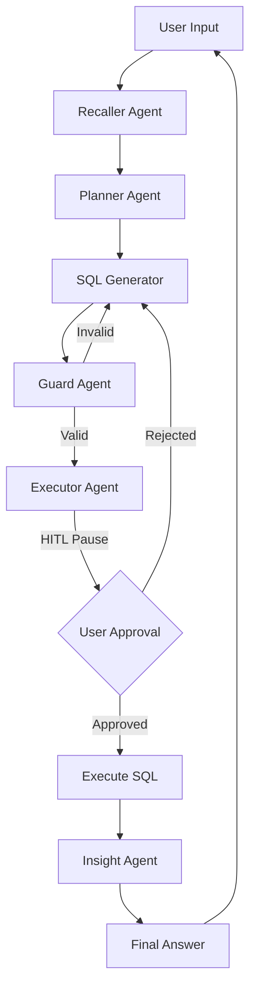

# 🤖 Multi-Agent AI Analyst

A production-ready, multi-agent SQL assistant that turns natural language questions into optimized PostgreSQL queries and actionable insights. Built with **LangGraph**, **Streamlit**, and **Neon Postgres**.

## 📐 System Architecture

A **StateGraph** orchestration pattern — not a linear chain — lets the system loop back for corrections when SQL is invalid or the Guard agent flags a security risk.

### 🔄 Workflow Diagram

### 🛠️ Technical Deep Dive

| Component | Technology | Purpose | Technical Detail |
| :--- | :--- | :--- | :--- |
| **Orchestration** | `LangGraph` | Workflow Control | Shared `AgentState` passes data between nodes; state persists via `thread_id`. |
| **LLM Engine** | `Groq / Llama 3` | Intelligence | High-token-per-second inference for real-time SQL generation and reasoning. |
| **Database** | `Neon Postgres` | Data Store | Serverless Postgres with logical branching; `psycopg_pool` for thread-safe concurrency. |
| **UI Layer** | `Streamlit` | Interface | Session-based auth gate and real-time HITL approval panels. |
| **Security** | `Bcrypt` | Auth | Salted password hashing — credentials never stored in plaintext. |

## 🧠 Agent Specifications

### 1. Recaller → Planner
- Analyzes `chat_history` to detect follow-ups vs. new requests.
- Outputs a refined, context-complete prompt for the Planner.

### 2. SQL Generator → Guard
- Generator builds SQL from the cached `db_schema`.
- Guard scans for `DROP`, `TRUNCATE`, or unauthorized `DELETE` operations.
- On failure, Guard sends a critique back to the Generator to rewrite the query.

### 3. Executor (HITL Node)
- Pauses execution via `langgraph.types.interrupt`.
- State persists to the database; graph resumes only on `Command(resume="approve")`.

### 4. Insight Agent
- Converts raw result sets into plain-English trends, anomalies, and answers — no raw JSON dumps.

## 🚧 Guardrails & Safety Controls

**Query-Level**
- Keyword denylist blocks destructive SQL (`DROP`, `TRUNCATE`, unscoped `DELETE`, etc.) before execution.
- Schema-constrained generation — no hallucinated tables/columns.
- Read-only by default; writes require explicit escalation.
- Capped self-correction loop prevents infinite retries.

**Human-in-the-Loop**
- Mandatory approval for all `INSERT` / `UPDATE` / `DELETE`.
- Pending queries persist to DB — auditable, session-safe approvals.
- Rejected queries route back to the Generator for refinement.

**Access & Abuse**
- Auth required for every session (`Bcrypt`-verified).
- Per-user quota: 5 queries/user.
- Thread-isolated state — no cross-user data leakage.
- Pooled DB connections (`psycopg_pool`) prevent exhaustion.

**Context & Output**
- Sliding-window memory limits prompt-injection surface.
- Input sanitization before context reaches downstream agents.
- Summarized output only — reduces accidental exposure of sensitive columns.

## 🌟 Key Features
- **🛡️ Human-In-The-Loop**: Manual approval for data-modifying queries.
- **🚧 Guardrails**: Keyword denylist, schema-constrained SQL, read-only default, and capped retry loops block unsafe queries pre-execution.
- **💾 Short-Term Memory**: Sliding-window context of the last turn.
- **🔐 Secure Auth**: Bcrypt-verified sessions with per-user quotas (5 queries/user) to prevent API abuse.

## 🚀 Getting Started
(Installation steps remain the same...)
